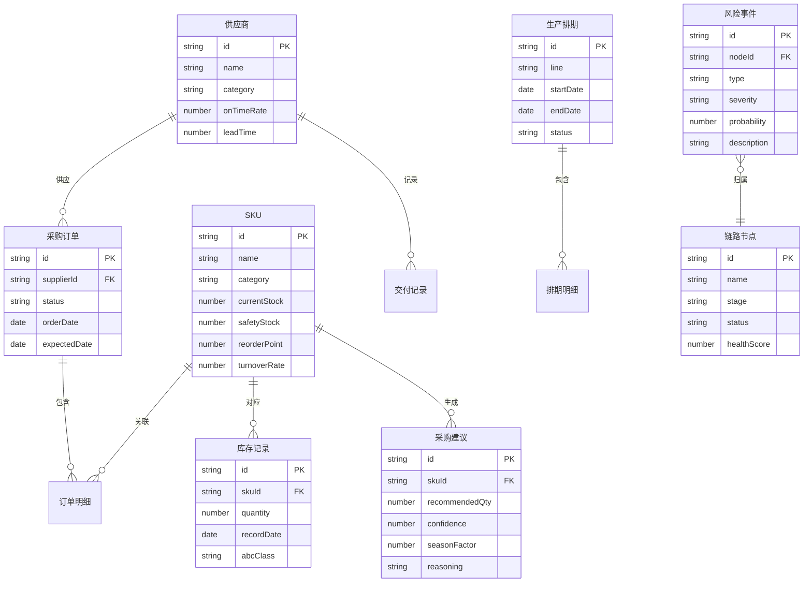

## 1. 架构设计

```mermaid
graph TB
    subgraph "前端层"
        "React SPA" --> "Zustand 状态管理"
        "React SPA" --> "Recharts 数据可视化"
        "React SPA" --> "React Router 路由"
    end
    subgraph "数据层"
        "Mock数据引擎" --> "供应链模拟数据"
        "Mock数据引擎" --> "库存模拟数据"
        "Mock数据引擎" --> "采购模拟数据"
        "Mock数据引擎" --> "排程模拟数据"
    end
    "React SPA" --> "Mock数据引擎"
```

## 2. 技术说明

- 前端：React@18 + TypeScript + TailwindCSS@3 + Vite
- 初始化工具：vite-init
- 后端：无（纯前端，使用Mock数据模拟）
- 数据库：无（使用内存Mock数据）
- 状态管理：Zustand
- 数据可视化：Recharts
- 图标库：Lucide React

## 3. 路由定义

| 路由 | 用途 |
|------|------|
| / | 全局监控仪表盘 |
| /inventory | 库存分析中心 |
| /risk | 风险与瓶颈识别 |
| /procurement | 智能采购建议 |
| /scheduling | 排程协调中心 |
| /balance | 三维度平衡分析 |

## 4. 数据模型

### 4.1 数据模型定义



## 5. 核心算法说明

### 5.1 季节性因子计算

基于历史24个月数据，按月计算季节指数 = 当月均值 / 总体均值，用于预测未来采购需求。

### 5.2 安全库存计算

安全库存 = Z值 × 标准差 × √平均提前期，其中Z值根据服务水平确定（95%对应1.65）。

### 5.3 瓶颈识别算法

基于各节点的吞吐量、等待时间和资源利用率，计算瓶颈指数 = 利用率 × (1 + 等待时间/处理时间)，指数超过阈值标记为瓶颈。

### 5.4 三维度平衡评分

- 成本得分 = (1 - 实际成本/预算上限) × 100
- 时效得分 = (准时交付数/总交付数) × 100
- 风险得分 = (1 - 加权风险值) × 100
- 综合得分 = 成本×0.35 + 时效×0.35 + 风险×0.30

## 6. 项目目录结构

```
src/
├── components/          # 通用组件
│   ├── Layout/          # 布局组件（侧边栏、顶栏）
│   ├── Card/            # 数据卡片组件
│   ├── Chart/           # 图表封装组件
│   └── Common/          # 其他通用组件
├── pages/               # 页面组件
│   ├── Dashboard/       # 全局监控仪表盘
│   ├── Inventory/       # 库存分析中心
│   ├── Risk/            # 风险与瓶颈识别
│   ├── Procurement/     # 智能采购建议
│   ├── Scheduling/      # 排程协调中心
│   └── Balance/         # 三维度平衡分析
├── store/               # Zustand状态管理
├── data/                # Mock数据
├── utils/               # 工具函数
└── types/               # TypeScript类型定义
```
